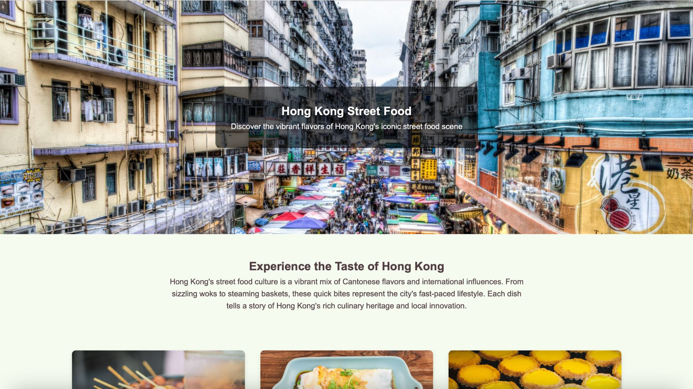

# 🍢 Street Food in Hong Kong  

 

A responsive website showcasing iconic Hong Kong street food with multimedia content, designed for accessibility and seamless viewing.

## ✨ Features
- **Food Highlights**: Curated selection of must-try street foods with descriptions
- **Embedded Videos**: YouTube content plays in-page (no redirection)
- **Accessible Design**:
  - High-contrast color scheme (dark text/light background)
  - Semantic HTML structure (headings, paragraphs)
- **Responsive Layout**: Adapts to mobile/desktop using CSS Flexbox/Grid

## 🛠️ Technologies
- **Frontend**: HTML5, CSS3
- **Hosting**: GitHub Pages
- **Multimedia**: YouTube embed API

## 🖥️ Live Demo
[View on GitHub Pages](https://wooaaron.github.io/Aaronwoo/) 

## 🏗️ Project Structure
Aaronwoo/
├── index.html
├── images/
│   ├── banner.jpg
│   ├── curry-fish-balls.jpg
│   ├── rice-rolls.jpg
│   └── egg-tarts.jpg
└── README.md

## 🚀 Installation (for local dev)
1. Clone repo:
   ```bash
   git clone https://github.com/wooaaron/Aaronwoo.git
2. Open index.html in browser
